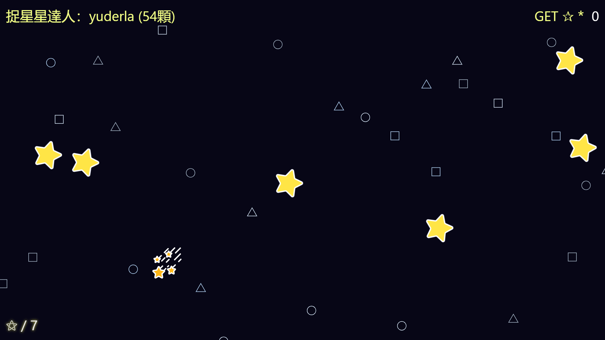

# 捉 星 星！Catch Star
網址：https://ya95123.github.io/game-catchStar/

### 遊戲概觀
傳說能捕捉越多星星的人，獲得越多上帝的祝福！
於是捉星星這項活動就成了 地球人 的傳統...

### 遊戲規則
以滑鼠點擊的方式來捕捉星星！星星會出現、移動而且會速率越來越快，當場上星星數達到 10 顆時，遊戲就結束了！  
唯有捕獲星星數最高的人，才可以出現在畫面左上角，成為捉星星達人，特別獲得神的祝福！

### 捕捉星星數(遊戲頁面右上角)
自己捕捉到的星星數量。

### 場上星星數(遊戲頁面左下角)
當場上星星數達 10 顆，捉星星時間即結束。

### 捉星星達人(遊戲頁面左上角)
只有捕捉星星最多的人才可以成為唯一的達人，若星星數相同，則是先捕捉到該星星數的人，繼續保持達人狀態。

### Tips
有流星出現時，請好好把握，捉到流星時，場上所有星星都會一起被捕捉！

### 示意圖

